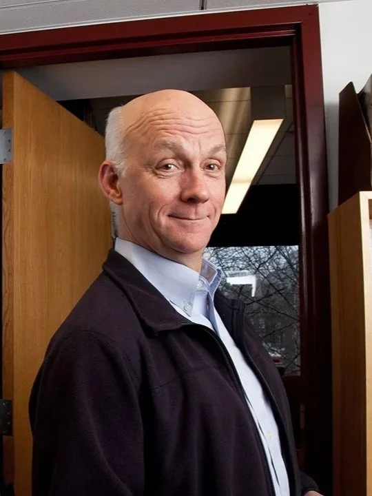

# Course Creators

This open-access course represents over two decades of collaborative teaching and learning about sustainable development. We—William ‘Bill’ Clark and Alicia Harley—have worked together at Harvard.

**Alicia Harley** is a Senior Research Fellow with the Sustainability Science Program, where she studies how communities build capacity to advance sustainable development, with particular focus on the role of science, technology, and innovation policy.

 

**Bill Clark** is the Harvey Brooks Research Professor of International Science, Public Policy and Human Development at Harvard Kennedy School. His research focuses on sustainability science and how knowledge can be harnessed for sustainable development.

 

We created this course because we believe that understanding sustainability requires both rigorous analytical frameworks and deep engagement with real-world complexity. Over years of teaching undergraduate and graduate students, we have continually refined our approach in response to feedback and new challenges.

Our motivation for making this course open access and freely available stems from the conviction that the opportunity to learn about the latest work in sustainability should not be confined to those at elite institutions.

This course emerged from extensive collaboration with colleagues and students who have challenged us to continually refine our approach. We're grateful to all who have contributed to making these materials possible.
