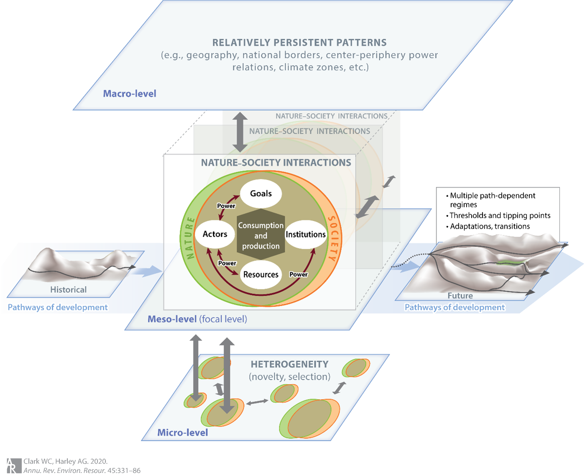

# Unit 2.8 Synthesis: How do interactions among the elements and relationships of nature-society systems shape pathways of development in the Anthropocene?

In Unit 1.1, we introduced a simple framework for analyzing nature-society systems. Throughout the rest of Part I of the course, we've explored individual elements of this simple framework in detail: goals for sustainable development (1.2) and resources that constitute the productive base that people can draw on to achieve those goals (1.3-1.5). In Part 2 of the course, we moved beyond this simple framework, exploring system dynamics including stocks and flows (2.1-2.2), nonlinearities and tipping points (2.3), horizontal connections linking places (2.4), vertical connections across levels (2.5), and actors with their institutions and power (2.6). In this unit, we will synthesize the concepts we have studied in part 2 of the course into a more complex version of the framework we introduced in Unit 1.1. This (evolving) framework is not meant to predict outcomes or serve as a grand theory of everything, rather it highlights what researchers have found useful to examine when studying how nature-society interactions unfold in different contexts. In other words, we use the framework as a helpful ‘checklist’ of elements and relationships worth considering when analyzing nature-society interactions—a first step to asking how we might transform nature-society systems onto more sustainable development pathways (something we will turn to in Part 3 of the course).

**Figure 2: Framework for Research in Sustainability Science. From Clark and Harley (2020). Annual Review of Environment and Resources.**

The framework (Figure 1 above) is developed in detail in reading ‘a’ of this Unit and summarized here. At the center of the figure are the intertwined nature-society interactions[1] we first encountered in Unit 1.1. The framework identifies four key elements involved in those interactions: goals (what people want from sustainable development), resources (the capital assets that may be natural or anthropogenic), actors (communities, firms, states and other entities with agency that strive to use resources to achieve their goals), and institutions (rules, norms, culture, beliefs that shape the behavior of actors). These elements are bound together through relationships of consumption and production, mediated by the relative power of different actor groups to affect one another's actions and beliefs (Unit 2.6). These elements and relationships generate emergent properties including the tendency toward inequality (Unit 2.7)—a pattern that appears across both natural and social systems and shapes how resources, power, and well-being are distributed among actors.

Context dependence is emphasized in the figure through multiple sets of nature-society systems that are always in play (shown by the multiple ovals in the figure's center), each with its own variants of goals, resources, actors, and institutions connected through production and consumption and mediated by power. The framework underscores the importance of being both specific about the particular nature-society interactions being studied (often called an ‘action situation’ or ‘focal case’ in the literature), while keeping in mind other potentially relevant nature-society systems and the potential horizontal connections among them (e.g., transboundary pollution, spill-over of local discoveries, migration, trade).

Nature-society interactions constitute a complex adaptive system, resulting in an emergent hierarchical structure, pictured here in terms of meso-, macro-, and micro-levels of organization. Lower (micro) levels highlight the heterogeneity (diversity) of elements often treated as aggregates at higher levels. While higher levels (macro) are often treated as immutable forces (e.g. governance arrangements, weather patterns) acting on the focal nature-society interactions of interest. This hierarchical character is why connections are such a focus of sustainability research: horizontal connections within levels, but also vertical connections between micro- and meso-levels (e.g., innovation) and between meso- and macro-levels (e.g., climate change, war).

The pathways of development emerging from these elements and relationships are strongly path dependent, exhibiting multiple regimes (valleys in the figure) separated by thresholds or tipping points (ridges). Adaptation keeps development pathways within their original regimes in the face of shocks. More rarely, transformation from one regime to another can occur due to changes in the underlying landscape or due to emergence of new technologies or social movements that challenge existing path dependence. Transformational changes can falter if they fail to cross into a new stable regime, precipitating development back into its original regime (see the trajectory running through the "green meadow" in the figure's future pathway).

---

## Preparation for class

To prepare for this unit, please:

**a) Read:**  
Clark, W. C., & Harley, A. G. (2020). Sustainability Science: Toward a Synthesis. Annual Review of Environment and Resources, 45, 331–386. https://doi.org/10.1146/annurev-environ-012420-043621  
> In this review paper we detail our Framework for Research in Sustainability Science (figure 1 above). For this unit, please read pages 331-342 in detail as they are foundational to synthesizing what you have learned thus far in this course and will prepare you well for moving forward into Part 3 of the course. We will read the rest of the paper in the next Unit as we begin to explore the capacities necessary to shift nature-society systems from unsustainable to sustainable pathways of development.

**b) Watch:**  
Clark, W. C., & Harley, A. G. (2020). Framework for Research in Sustainability Science (video presentation 15 mins). In National Academies of Sciences, Engineering and Medicine (Ed.), Progress Challenges and Opportunities for Sustainability Science A Workshop (p. 15 mins.). National Academies of Science (USA). https://scholar.harvard.edu/files/wclark/files/framework_for_research_in_sustainability_science_nas.mp4  
> This video provides an overview of the Framework for Research in Sustainability Science introduced in reading ‘a’ above. It was recorded as part of the introduction to a workshop on sustainability science held by the National Academy of Sciences. The slides used in the presentation are available here.

**c) Review as needed:**  
Thompson, M. (2021). The Alaskan Salmon Fishery: Managing Resources in a Globalizing World. Harvard University. Available [HERE](../teaching-cases/case-alaska.pdf) in the teaching case folder.

---

## Study Questions to help you get the most out of the readings

**I. Nature-society interactions and system dynamics:** In Unit 1.1, you identified basic nature-society interactions in the Alaska salmon fishery case. Now, with your understanding of system dynamics: What are the key reinforcing feedback loops that have driven boom-bust cycles? What balancing feedbacks have helped stabilize the system since the 1970s? Identify a potential tipping point and early warning signals that might indicate the system is approaching this threshold.

**II. Resources, connections, and flows:** How have stocks of key resources (natural and anthropogenic) in the Alaska fishery changed over time? Trace how horizontal connections link Alaska's salmon to global markets and how vertical connections allow local innovations (like hatchery systems) to scale up. Why did some innovations spread system-wide while others (like fish traps) were abandoned?

**III. Power, actors, and institutions:** How do power relationships between processors, fishers, regulators, and Native communities shape production decisions and governance? How have these dynamics changed from the cannery era to today's limited entry system? How do institutions like the limited entry permit system, escapement-based management, and fishing technology regulations (such as the ban on fish traps and gear restrictions) actually function to mediate between different actors' interests and constrain or enable their actions?

**IV. Inequality in the fishery:** Building on your analysis of power dynamics above, how do these relationships create and maintain inequalities in the distribution of benefits from the fishery? Which groups have gained or lost access to resources over time, and how have institutional changes either reduced or reinforced these inequalities?

**V. Comprehensive sustainability assessment:** Drawing on the inclusive wealth framework (Unit 1.5) and system dynamics:  
a. Assess whether the Alaskan salmon fishery's current trajectory is sustainable, considering the full portfolio of capital assets  
b. How do threshold effects and path dependencies determine whether consumption is "too much"?  
c. How might climate-driven shifts affect different communities' inclusive wealth differently?

**VI. Path dependence and thresholds:** How has Alaska's history created path dependencies that constrain current options (consider the legacy of cannery infrastructure, limited entry permits, established fishing communities)? What forces keep the fishery operating within its current regime despite various shocks? What combination of pressures might push the system across a threshold into a fundamentally different state - and what might that alternative state look like?

**VII. Your own case:** Apply this integrated framework to a sustainability challenge you're familiar with, identifying key feedbacks, important connections (horizontal and vertical), path dependencies and thresholds, and potential interventions that might shift your case toward sustainability.

---

## Digging deeper (optional materials for further exploring frontiers in the pursuit of sustainability):

**d) Read:**  
Meyfroidt, P., Roy Chowdhury, R., de Bremond, A., Ellis, E. C., Erb, K.-H., Filatova, T., Garrett, R. D., Grove, J. M., Heinimann, A., Kuemmerle, T., Kull, C. A., Lambin, E. F., Landon, Y., le Polain de Waroux, Y., Messerli, P., Müller, D., Nielsen, J. Ø., Peterson, G. D., Rodriguez García, V., … Verburg, P. H. (2018). Middle-range theories of land system change. Global Environmental Change, 53, 52–67. https://doi.org/10.1016/j.gloenvcha.2018.08.006  
> Both of the ‘digging deeper’ papers assigned for this unit address deep questions of the use theories and frameworks in sustainability science. They are meant for students wishing to reflect not just on the synthetic framework we present here, but also on broader questions of types of theories and frameworks that are useful for those interested in furthering the cause of sustainable development. The first paper by Meyfroidt et al. explores how to develop theories that bridge highly context-dependent cases and universal principles—a central challenge in applying frameworks to real-world sustainability problems. The authors discuss different approaches to theorizing about nature-society systems at intermediate levels of abstraction.

**e) Read:**  
Schlüter, M., Caniglia, G., Orach, K., Bodin, Ö., Magliocca, N., Meyfroidt, P., & Reyers, B. (2022). Why care about theories? Innovative ways of theorizing in sustainability science. Current Opinion in Environmental Sustainability, 54, 101154. https://doi.org/10.1016/j.cosust.2022.101154  
> The second paper by Schlüter et al. examines how different research approaches—from frameworks to models to empirical studies—can be integrated to better understand the complex causal relationships in nature-society systems. It provides valuable perspective on how the framework presented in this unit relates to other tools for sustainability analysis.

---

[1] Terminology note: As you have seen already, you will encounter various terms for these intertwined systems throughout the literature—"social-environmental systems" (as used in the Matson et al. 2016 book), "nature-society systems" (as we use here and in the readings for today), "social-ecological systems" (common in resilience literature), and sometimes "coupled human-natural systems." These all refer to the same basic concept: the integrated systems formed by the co-evolution of human societies and the natural environment.