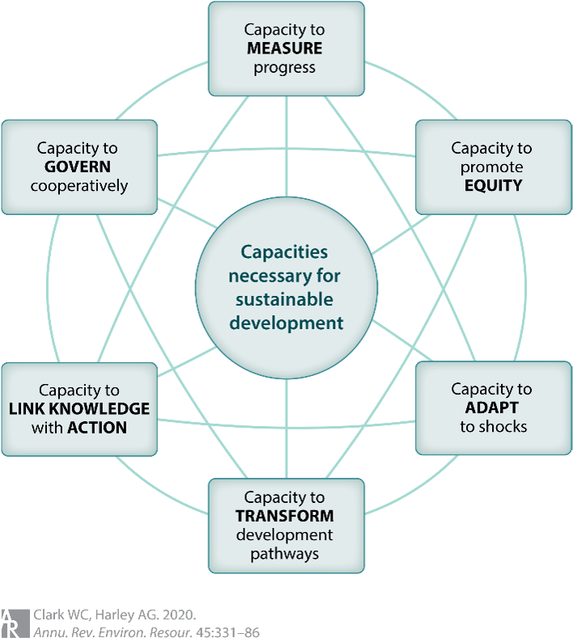

# Unit 3.1 Capacities for sustainable development: What capacities are needed to guide development pathways toward sustainability?

Having explored the conceptual foundations of sustainable development in Part I of this course and examined the properties of the Anthropocene as a complex adaptive system in Part II, we now turn to the practical question of implementation. The pursuit of sustainability is not simply a matter of understanding problems or setting good intentions. It requires the ability to get things done—to connect widespread agreement on the goals of sustainable development with effective action. Yet too often societies fail to act at the speed and scale that many sustainability challenges require. This is at least in part because traditional approaches focus on understanding problems rather than building the practical capacity to act in contexts of uncertainty, competing interests, and inevitable surprises. This unit introduces Part III of the course by asking a fundamental question: What strategic capacities do advocates for sustainable development need in order to successfully guide development pathways toward sustainability?

As discussed in Part II, development pathways in nature-society systems are complex, characterized by nonlinear dynamics, tipping points, path dependence, multi-scale interactions and actors with agency and power. Given these properties, science has substantial ability to understand, but limited ability to predict, how long term development pathways will actually unfold. This means that interventions intended to promote sustainable development cannot be engineered from the top down or fully mapped out in advance. Instead, they must emerge through adaptive processes that combine the best available knowledge with ongoing experimentation and learning from both successes and failures. Moreover, pursuing sustainability requires continuous 'everyday' work—monitoring, adjusting, coordinating—undertaken by diverse actors working across a wide range of contexts. The challenge is how these actors, whether individuals, communities, organizations or states, can prepare for and carry out the ongoing work of fostering sustainable development.

One approach to this challenge that has emerged in recent years focuses on building and maintaining capacities for sustainable development. By capacity we mean both the intention and the ability to accomplish a task or achieve an outcome or, more bluntly, "the ability to get stuff done." This capacity-building approach represents a fundamental shift from asking ‘What’s to be done?’ to ‘How can people build and maintain the collective ability to figure out what to do and then to actually do it?’

Figure 3: Six Capacities Necessary for Sustainable Development (Clark and Harley, 2020)

Research over the past two decades has identified six strategic capacities that appear essential for the successful pursuit of sustainability: the capacity to measure progress, the capacity to promote equity, the capacity to adapt to shocks and surprises, the capacity to transform unsustainable development pathways, the capacity to link knowledge with action, and the capacity to devise governance arrangements that enable people to work together in exercising the other capacities (see figure 1). The next 6 units focus on what is known from both research and practice about each of these six capacities.

---

## Preparation for class

To prepare for this Unit, please:

**a) Read:**  
Clark, W. C., & Harley, A. G. (2020). Sustainability Science: Toward a Synthesis. Annual Review of Environment and Resources, 45(1), 331–386. [https://doi.org/10.1146/annurev-environ-012420-043621](https://doi.org/10.1146/annurev-environ-012420-043621)  
> This review synthesizes two decades of sustainability science research and introduces the six-capacities framework that structures Part III of this course. You began this paper in Unit 2.8, where you read pages 331-342 covering the Framework for Research in Sustainability Science. Now complete the paper by reading pages 343-372, which detail the six capacities for sustainable development that will guide Part III of this course.

**b) Read:**  
Sen, A. (2000). Development as Freedom (1st Anchor Books ed.). Anchor Books.  
> This foundational work introduces Amartya Sen's influential “capabilities” approach, which focuses on expanding individual human capabilities and freedoms. While you read reflect on the differences between how Sen conceptualizes capabilities and how capacities are conceptualized in the readings for this unit.

**c) Explore:**  
United Nations Department of Economic and Social Affairs. (n.d.). Capacity Development. Retrieved December 20, 2024, from [https://sdgs.un.org/topics/capacity-development](https://sdgs.un.org/topics/capacity-development)

---

## Study Questions to help you get the most out of the readings

**I. Capacities as a collective endeavor:** Sen's capabilities approach (reading ‘b’) focuses on expanding individual freedoms and capabilities (what people can actually do and be), while the six-capacities framework (reading ‘a’) focuses on collective capacities that societies need to navigate toward sustainability. How do these two approaches relate to each other?  

**II. Global perspectives on capacity development:** How does the UN conceptualize "capacity development" (reading ‘c’) compared to the six-capacities framework presented in Clark & Harley (reading ‘a’)? What assumptions does each approach make about who needs capacity, who builds it, and how it develops? What are the strengths and limitations of each approach?

**III. Building capacities:** The place-based nature of sustainability challenges discussed in Clark & Harley (reading ‘a’) means that these capacities must be built by "diverse communities" working together "across places and time." What does this suggest about the scale and scope of capacity building efforts? What are the implications for how we think about sustainability as a collective endeavor?

**IV. Capacity trade-offs and tensions:** Reading ‘a’ emphasizes that the six capacities are interdependent—they often function as complements but can also exist in tension with one another. Can you think of examples where building one capacity might conflict with building another? How might practitioners navigate such trade-offs?

**V. Capacities in Appalachia:** Reflecting on the Appalachia case assigned earlier in the course in Unit 2.6: Given the region's history of resource extraction, power imbalances, and community resistance movements, which of the six capacities are most needed to be strengthened by local actors to better foster sustainable development in the region today? Explain your reasoning.

**VI. Your own case:** Consider a sustainability challenge you're familiar with (it could be from your hometown, a case study from earlier in this course, or current events). Which of the six capacities seem most relevant to addressing that challenge? Which of the capacities seem least developed among the relevant actors?

---

## Digging deeper (optional materials for further exploring a broad perspective on capacity building):

**d) Read:**  
Mazzucato, M., & Kattel, R. (2020). COVID-19 and public-sector capacity. Oxford Review of Economic Policy, 36(Supplement_1), S256–S269. [https://doi.org/10.1093/oxrep/graa031](https://doi.org/10.1093/oxrep/graa031)  
> This reading looks at the capabilities and capacities that were too often missing from governments' responses to the outbreak of the COVID-19 pandemic. The capacities it focuses on (capacity to adapt and learn; capacity to align public services and citizen needs; capacity to govern resilient production systems; and capacity to govern data and digital platforms) are slightly different from the six capacities we will highlight in Part III of this course. Nevertheless, it is a powerful argument about the importance of capacities in our collective ability to respond to shocks and surprises—a theme central to our understanding of managing under deep uncertainty.

---

<a href="../course-library/unit-guides/unit-3-1.pdf" target="_blank" style="display:inline-block; padding:10px 20px; background:#2F5496; color:white; border-radius:5px; text-decoration:none; font-weight:bold; margin-top:24px;">
Unit 3.1 Reading Guide (PDF)
</a>