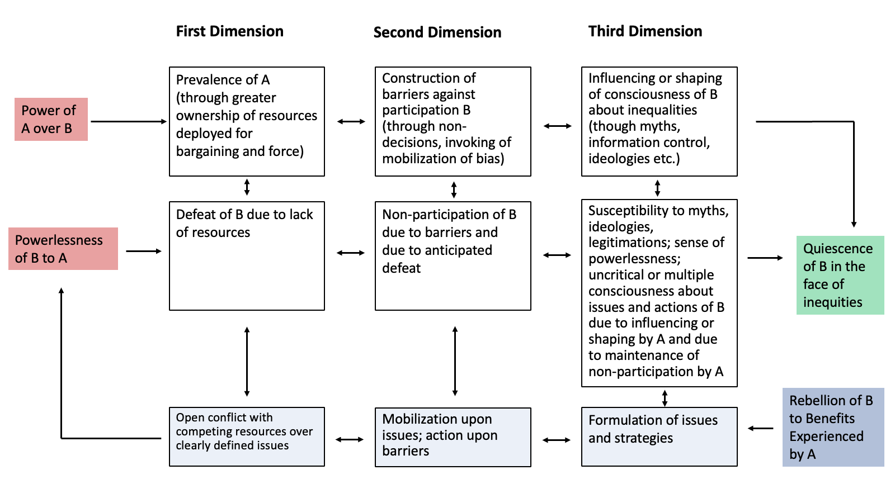

# Unit 3.2 Capacity to Promote Equity: How can we promote equitable distribution of the fruits of the earth’s resources within and between generations?

Equity —the fair distribution of resources within and between generations—stands at the heart of sustainable development. The Brundtland Commission made this clear in 1987, and subsequent international deliberations have reaffirmed this perspective: alleviating poverty among today's most vulnerable while ensuring that efforts to improve well-being today do not undermine the prospects of those seeking it tomorrow.

Yet despite these normative commitments, the equity dimension of sustainability is often strangely neglected in practice. One need look no further than the UN SDGs for evidence of this neglect—while the preamble acknowledges "present and future generations," none of the 17 SDGs explicitly addresses intergenerational equity. This gap between aspiration and action becomes less surprising when we consider what you've learned in [unit 2.6](../part-2-anthropocene/unit-2-6-appalachia.md){:target="_blank"}: power concentrates in the hands of incumbent actors who benefit from existing inequalities, while inequality itself emerges as a natural tendency in complex systems, reinforced by positive feedback loops that make the rich get richer and the poor get poorer.

In this unit, we explore what research tells us about building a stronger capacity to promote equity both within and between generations—not just as a moral imperative, but as a strategic necessity for sustainable development. Building on your understanding of how power creates and maintains inequality, we now turn to the practical question: How can actors develop the capacity to counter those dynamics and to instead foster more equitable distributions of well-being?

Building capacity to promote equity requires more than good intentions or moral commitments. It demands strategic action that confronts power across all its dimensions. As John Gaventa argues in his classic study of power in Appalachian coal country (reading ‘d’ from [unit 2.6](../part-2-anthropocene/unit-2-6-appalachia.md){:target="_blank"}), the three dimensions of power can also reveal pathways to empowerment. Just as powerful actors use resources to compel (first dimension), institutions to exclude (second dimension), and narratives to influence (third dimension), movements for equity must develop countervailing strategies across all three dimensions. The framework below (adapted from Gaventa 1980) illustrates how each dimension of powerlessness points toward specific empowerment strategies.

This framework (see figure 1) reveals that building capacity to promote equity involves three interconnected strategies:
- **Issue and action formation (countering the third dimension):** Developing critical consciousness about structural inequities and the narratives that naturalize them; formulating alternative visions and strategies for change.
- **Mobilization upon barriers (countering the second dimension):** Identifying and dismantling institutional barriers that exclude marginalized actors from decision-making; creating new spaces for participation.
- **Resource mobilization (countering the first dimension):** Building coalitions and marshaling resources to contest decisions in open arenas; developing the organizational capacity for sustained collective action.

Figure 4: The Three Dimensions of Power and Empowerment (Adapted from Gaventa, 1980, p. 21)

These strategies have proven effective across diverse contexts. Movements have successfully shifted narratives from GDP growth to wellbeing and SDGs (countering third dimension influence), placed climate change and sustainability on policy agendas that previously ignored them (countering second dimension exclusion), and enabled indigenous communities to reclaim ancestral lands and establish marine protected areas (countering first dimension compulsion). Each victory demonstrates that the same dimensions of power used to maintain inequality can be redirected toward equity.

That said, such victories have been far from universal or irreversible. Capacity building to promote equity must persistently address two distinct but related equity challenges. Intra-generational equity requires redistributing resources and opportunities among today's actors—a challenge complicated by the self-reinforcing dynamics of inequality explored in [unit 2.6](../part-2-anthropocene/unit-2-6-appalachia.md){:target="_blank"}. Intergenerational equity demands protecting resources and opportunities for future generations who cannot advocate for themselves in today's decision-making. The same power imbalances that create inequality within generations also determine whose voices shape decisions about the future. This continues to result in development pathways that discount both the needs of today's marginalized communities and tomorrow's generations.

---

## Preparation for class

To prepare for the class, please:

**a) Read:**  
Hoen, E. ’t, Berger, J., Calmy, A., & Moon, S. (2011). Driving a decade of change: HIV/AIDS, patents and access to medicines for all. Journal of the International AIDS Society, 14, 15. [https://doi.org/10.1186/1758-2652-14-15](https://doi.org/10.1186/1758-2652-14-15)  
> Documents how activists and NGOs successfully confronted pharmaceutical industry power to ensure access to life-saving HIV/AIDS medicines in developing countries, demonstrating effective empowerment strategies in action.

**b) Explore:**  
Our Children’s Trust. (n.d.). Juliana v. United States. Retrieved October 12, 2025, from [https://www.ourchildrenstrust.org/juliana-v-us](https://www.ourchildrenstrust.org/juliana-v-us)  
> Review this landmark youth climate litigation case as an example of innovative strategies to promote intergenerational equity through legal mechanisms that give voice to future generations' interest.

**c) Review:**  
Harley, A., & Wexner, H. (2022). The Struggle for Sustainable Development in Appalachia’s Mineral Rich Mountains. Sustainability Science Program Working Paper, 2022(1), 65. (Available in Course Library).  
Read Sections 10-11 (pages 34-47), focusing on how citizen activism confronted the three dimensions of coal company power.  
> Building on your analysis of power in Appalachia ([unit 2.6](../part-2-anthropocene/unit-2-6-appalachia.md){:target="_blank"}), these sections examine how marginalized communities have employed empowerment strategies to challenge entrenched interests, from the Pittston strike to contemporary environmental justice movements.  
> The full PDF is available to download [HERE](../course-library/teaching-cases/case-appalachia.pdf).

---

## Study Questions to help you get the most out of the readings

**I. From power analysis to strategies for empowerment:** Using the Gaventa framework presented in this unit, identify specific examples from Sections 10-11 of the Appalachian case (reading ‘c’) where marginalized actors successfully employed each of the three empowerment strategies (issue and action formation, mobilization against barriers, and resource mobilization). Which dimension of power was hardest to counter effectively and why?

**II. Empowering marginalized voices within and between generations:** Compare the strategies of empowerment used in the HIV/AIDS campaign (reading ‘a’) with the legal approach in the Juliana case (reading ‘b’). How do these different mechanisms work to ensure those without power are heard in current decision-making? What are their strengths and limitations?

**III. Your case:** Apply the three-dimensional empowerment framework from this unit to a marginalized group in your chosen sustainability challenge. Design a comprehensive strategy that addresses all three dimensions of power. What resources, alliances, and institutional changes would be needed? What barriers would be most difficult to overcome?

---

## Digging deeper (optional materials for further exploring frontiers in the pursuit of sustainability):

**d) Read:**  
Harley, A. G., & Clark, W. C. (2025). [Building Capacity to Promote Equity with and among Generations: Lessons from scholarship and practice](https://www.hks.harvard.edu/sites/default/files/centers/mrcbg/programs/sustsci/files/Equity%20Capacity_SSP%20Working%20Paper.pdf) (Nos. 25–04; Sustainability Science Program Working Paper, pp. 1–19). Harvard Kennedy School of Government.  
Also available in the course library [HERE](../course-library/readings/capacity-equity.pdf).  
> This working paper provides important background on equity-building strategies across different contexts globally. While academic in style, it offers a useful synthesis of lessons from practice that will inform your analysis of the specific cases.

**e) Read:**  
Chenoweth, E. (2021). Civil resistance: What everyone needs to know. Oxford University Press.  
> Analyzes what makes social movements succeed or fail, with implications for building sustained capacity for equity promotion through collective action.

**f) Read:**  
Boston, J. (2017). Governing for the Future: Designing Democratic Institutions for a Better Tomorrow (First edition). Emerald.  
> Examines how democratic institutions can be designed to protect future generations' interests, addressing the challenge of "presentist bias" in policy-making and proposing concrete mechanisms for intergenerational equity.

**g) Explore:**  
Sabin Center for Climate Change Law, Columbia Univ. (n.d.). The Climate Litigation Database. Retrieved October 12, 2025, from [https://www.climatecasechart.com](https://www.climatecasechart.com)  
> For students interested in exploring the wider landscape of climate litigation beyond youth cases, the Sabin Center maintains comprehensive databases tracking over 3,000 climate cases worldwide, including constitutional and human rights cases that address intergenerational equity through various legal strategies.

---

<a href="../course-library/unit-guides/unit-3-2.pdf" target="_blank" style="display:inline-block; padding:10px 20px; background:#2F5496; color:white; border-radius:5px; text-decoration:none; font-weight:bold; margin-top:24px;">
Unit 3.2 Reading Guide (PDF)
</a>